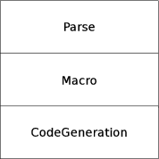

=====================================
メタプログラミング
=====================================


Elixirマクロ入門
-------------------------------------

Elixirのマクロはコンパイルプロセス中において、構文解析後のツリーを入力
として、別のツリーを返すフックとして機能します。そして、そのフックは
Elixir自身を用いて記述することができます。この記述のしやすさと、Elixir
のクロージャサポートによりLispなみの拡張性を持っています。



Elixirプログラムのデータ構造としてのツリー表現
----------------------------------------------

elixirはhomoiconic言語です。つまりプログラムをプログラム中でデータ構造
として扱うことができるという事です。どんなelixirプログラムでもそれ自身
のデータ構造を使用して表現することができます。このセクションは、そのよ
うなデータ構造としてのelixir言語の仕様を記述します。elixirの
homoiconicityの構築ブロックは3要素のタプルです。例えば:

.. code-block:: elixir
   :linenos:

    { :sum, [], [1, 2, 3] }

上のタプルは1,2,3を引数にして関数sum/3の呼び出しを表現しています。
このタプルの要そは以下のとおりです:

.. code-block:: elixir
   :linenos:

    { Tuple | Atom, List, List | Atom }

* タプルの最初の要素は、アトムあるいは他のタプル表現です。

* タプルの第2の要素は、コンテキスト情報を表すリストです。

* タプルの第3の要素は、関数呼び出しの引数です。第3引数は(nilあるい
  は:quoted)アトムである場合もあります。そして、それが関数呼び出しでは
  なく、変数である事を意味します。

quote do: 式 マクロを用いて任意の式のデータ構造表現を得ることができます:

.. literalinclude:: ../codes/quote_do_sum.lst
   :language: elixir
   :linenos:

.. runblock:: iex

   > quote do: sum(1,2,3)
   > quote do
   >   sum(1,2,3)
   > end


elixirでは全ては関数呼び出しで、それは前述のタプルで表現できます。例えば、以下の様な演算子を含む式は以下の様になります。

.. runblock:: iex

   > quote do: 1 + 2

3要素以上のタプルも"{}"関数になります。

.. runblock:: iex

   > quote do: { 1, 2}
   > quote do: { 1, 2, 3}


このルールの例外はたった五つのElixirリテラルだけです。リテラルはquoteさ
れるとそれ自身を返すデータ型で、それらは以下のとおりです:

.. runblock:: iex

   > quote do: :atom # atom
   > quote do: 2.0 # number
   > quote do: [1, 2, 3] # list
   > quote do: "binary" # binary
   > quote do: {:key,  :value} # 2 element tuple

また、変数は、Elixirという印がついたアトムのタプルになります。

.. runblock:: iex

   > x=1
   > quote do: x

doブロックは:__block__関数になります。

.. runblock:: iex

   > quote do
   >   1
   >   2
   > end


これでユーザ定義のマクロを定義する準備ができました。Doug HoyteはLet
Over Lambdaで「他のすべての言語が単にLispに薄い皮をかぶせたにすぎないと
いうことが分かるだろう」と書いています。その通りなのですが、他の言語と
違い、Elixirはいつでもその薄い皮を剥がすことができるということです。

マクロ定義
----------------------------------------------

ユーザ定義のマクロを定義する
``````````````````````````````````````````````

“defmacro”を使用してマクロを定義することができます。例えば、unlessと
呼ばれるマクロを定義することができます。それはちょっとしたコードでちょ
うどRubyのunlessと同じように働きます。

.. literalinclude:: ../codes/defmacro_unless.exs
   :language: elixir
   :linenos: 
   :lines: 1-7

上の例では、unlessは二つの引数を受けて呼ばれます。
“clause”と”options”です。しかし、unlessはそれらの値を受け取る訳では
なく、式を受け取る点に注意してください。例えば、次の呼び出しでは、
2 + 2 == 5 という式が評価されずに渡されています。

.. runblock:: iex

   > c("codes/defmacro_unless.exs")
   > require MyMacro
   > MyMacro.unless 2 + 2 == 5, do: IO.puts("unless")
   > IO.puts Macro.to_string Macro.expand_once(quote do
   >                     MyMacro.unless 2 + 2 == 5, do: IO.puts("unless")
   >                   end, __ENV__)

MyMacro.unless側では、ifのツリー構造を返す為に"quote"を呼びます。
これは"if"で我々の"unless"をトランスレートしていることを意味します。
しかしながら、開発者が通常"quote"された式の要素を"unquote"し忘れるのは
共通のミスです。"unquote"が何をするかを理解するために取り除いてみましょう。

.. literalinclude:: ../codes/defmacro_unless_fail.exs
   :language: elixir
   :linenos: 
   :lines: 1-7

これをコンパイルして呼び出すとこのようになります。

.. runblock:: iex

   > c("codes/defmacro_unless_fail.exs")
   > require UnlessFail;
   > IO.puts Macro.to_string Macro.expand_once(quote do
   >   UnlessFail.unless 2 + 2 == 5, do: IO.puts("unless")
   > end, __ENV__)

unquoteが無いバージョンではclauseとoptionsという関数を呼び出すようになっ
ていることに注意してください。
言い替えると、"unquote"は"quote"されたツリーに式を組込むメカニズムで、
メタプログラミングメカニズムの本質です。

elixiではリストをunquoteして、もとの式のリスト中に差し込むことを一度にする
unquote_splicing/1も提供しています。

.. runblock:: iex

   > quote do: [1, unquote_splicing([2,3,4]), 5]

elixirで提供されているビルトインマクロのオーバーライドを含めて、欲しい
と思う任意のマクロを定義することができます。elixirスペシャルフォームの
オーバーライドができないと言う事だけが例外です。Kernel.SpecialFormsにそ
の例外となるスペシャルフォームがリストされています。

健全なマクロ
``````````````````````````````````````````````

elixirマクロはScheme協定に従っていて、健全(hygienic)です。これはマクロ
の内側で定義された変数はマクロが使われたコンテキストで定義された変数と
衝突しないという事を意味します。例えば

.. runblock:: iex

   > defmodule Hygiene do
   >   defmacro testmacro do
   >     quote do: a = 1
   >   end
   > end
   > a = 10
   > require Hygiene; Hygiene.testmacro
   > a  ## マクロによって変更されない


このように、testmacroの内部でaに1を束縛しても、それは外部に影響を及ぼし
ません。マクロでコンテキストに影響を与えたい場合は、 var!()を使うことが
できます:

.. runblock:: iex

   > defmodule Hygiene2 do
   >   defmacro testmacro do
   >     quote do: var!(a) = 1
   >   end
   > end
   > a = 10
   > require Hygiene2; Hygiene2.testmacro
   > a  ## 今度は変更される

var!()によってマクロが展開された場所のコンテキストで変数が
評価されることが分ります。

マクロの展開過程を確認するために、Macro.expand/2, Macro.expand_once/2が
あります。Macro.expand/2はマクロを全て展開してしまうため却って分かり難く
なります。これらがASTを返しますが、これらをelixirのシンタックスに
文字列として変換する、Macro.to_string/1もあります。

.. runblock:: iex

   > require MyMacro;
   > MyMacro.unless 2 + 2 == 5, do: IO.puts("unless")
   > m = Macro.expand_once(quote do
   >                    MyMacro.unless 2 + 2 == 5, do: IO.puts("unless")
   >                  end, __ENV__)
   > IO.puts Macro.to_string(m)
   > m = Macro.expand(quote do
   >                    MyMacro.unless 2 + 2 == 5, do: IO.puts("unless")
   >                  end, __ENV__)
   > IO.puts Macro.to_string(m)


これまでquoteを使ってきましたが、直接ASTを構成するタプルを返して
マクロを作ることもできます。たとえば、引数を2倍するマクロを作ってみます。
:"+" 関数に引数を渡すplus/1マクロを書いてみます。

.. runblock:: iex

   > defmodule Plus do
   >   defmacro plus(x) do
   >     {:"+", [], [x, x]}
   >   end
   > end
   > require Plus
   > Plus.plus(4)
   > IO.puts Macro.to_string(Macro.expand(quote do
   >                                        Plus.plus(4)
   >                                      end, __ENV__))

一見上手く動いているように見えますが、微妙なバグがあります。

quoteを使っていないので、unquoteも使う必要はありません。このような単純
な場合にはquoteを使うほうが遥かに楽ですが、複雑な式の変換を行う際には
直接ASTをハンドルする必要が出て来ます。


プライベートマクロ
``````````````````````````````````````````````
あるモジュールで定義されたマクロはそのモジュールの中では呼び出すことは
出来ません。defmacropで定義されたプライベートマクロは逆でモジュール
内でのみ呼び出しが可能です。プライベートマクロはガード式など
関数呼びだしが許されない場所で良く使われます。

.. runblock:: iex
   
   > defmodule IsEven do
   >   defmacrop is_even(x) do
   >     quote do
   >       rem(unquote(x), 2) == 0
   >     end
   >   end
   >   def add_even(a, b) when is_even(a) and is_even(b) do
   >     a + b
   >   end
   > end

プライベートマクロは前方参照を許していませんので、定義するまえに使うと
エラーとなります。

.. runblock:: iex
   
   > defmodule IsEven do
   >   def add_even(a, b) when is_even(a) and is_even(b) do
   >     a + b
   >   end
   >   defmacrop is_even(x) do
   >     quote do
   >       rem(unquote(x), 2) == 0
   >     end
   >   end
   > end


マクロの実際
-------------------------------------

マクロ delegate [{name, arity} | t], do: target を考えてみます。これは、
あるモジュールの関数群を他のモジュールに委譲したい場合に使う事を目的と
しています。例えば、MyListという独自リストモジュールを定義していて
reverse/1とmember/2をEnumモジュールをそのまま使いたい場合です。

.. code-block:: elixir
   :linenos:

    defmodule MyList do
      delegate [reverse: 1, member: 2], to: Enum
    end

これをこんなふうに展開されたいわけです。

.. code-block:: elixir
   :linenos:

    defmodule MyList do
      ## delegate [reverse: 1, member: 2], to: :lists
      def reverse(arg1) do
        apply :lists, reverse, [arg1]
      end
      def member(arg1, arg2) do
        apply :lists, member, [arg1, arg2]
      end
    end

ではdelegateマクロを実装していきましょう。
コアはこんな感じです。


.. code-block:: elixir
   :linenos:

    defmodule MyMacro do
      defmacro delegate1([{fname, arity}| t], to: module) do
        args = makeargs(arity)
        quote do
          def unquote(fname).(unquote_splicing(args)) do
            apply unquote(module), unquote(fname), [unquote_splicing(args)]
          end
        end
      end
    end

makeargs/1は指定された数だけの仮引数として使用できるアトムリストを返す
関数であり、このように作ることができます。

.. literalinclude:: ../codes/delegate.exs
   :language: elixir
   :linenos: 
   :lines: 2-8

delegate1は渡された最初の{fname, arity}のみ処理しているので、残りの部分
を処理するよう書き換えます。

.. literalinclude:: ../codes/delegate.exs
   :language: elixir
   :linenos: 
   :lines: 9-23

このようにマクロのなかから関数を呼ぶことが出来ますが、マクロが自分自身
を呼び出すことは出来ません。
末尾再帰の形をEnum.map/2で書き直すと以下のようになり、幾分すっきりします。

.. literalinclude:: ../codes/delegate.exs
   :language: elixir
   :linenos: 
   :lines: 24-34

実行結果は以下のとおりです。

.. runblock:: iex

   > c("codes/delegate.exs")
   > MyList.member?([1,2,3], 3)
   > MyList.reverse([1,2,3])
