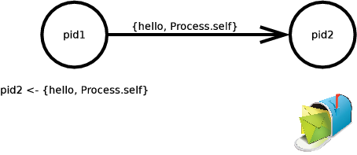

=====================================
簡単な構文説明
=====================================

データタイプ
-------------------------------------

基本データタイプ
~~~~~~~~~~~~~~~~~~~~~~~~~~~~~~~~~~~~~

基本データタイプは以下のとおりです。

.. literalinclude:: ../codes/basic_data_type.lst
   :language: elixir
   :linenos:

.. _関数:

関数
~~~~~~~~~~~~~~~~~~~~~~~~~~~~~~~~~~~~~

関数オブジェクト(無名関数)もありますが、変数に格納された関数を呼び出す
ときには、変数と引数をドットで区切ります。無名関数の定義方法は、fn()
-> body endになります。

.. literalinclude:: ../codes/function_object.lst
   :language: elixir
   :linenos:

関数に渡す引数の数をアリティと呼びます。

関数は所属するモジュールやアリティが異なると全く違う関数として認識され
ます。従って関数は、モジュール名.関数名/アリティのような書式で記述する
事で識別します。

タプル
~~~~~~~~~~~~~~~~~~~~~~~~~~~~~~~~~~~~~

タプルとは、項目の集まりを格納するために使う、複合的な型です。タプルは
{}で囲み、個々の要素は任意の値をとることができ、カンマで区切ります。タ
プルは複雑な構造を記述する際の中心となる構造です。タプルの最初の要素を
そのタプルの内容を表すアトムにする方法はよくとられます。

.. literalinclude:: ../codes/tuple_data_type.lst
   :language: elixir
   :linenos:

elem/2により内部の要素を取得できます。また、set_elem/3により一部の要素
を変更した新しいタプルを作成することができます。要素の位置は0始まりです。

リスト
~~~~~~~~~~~~~~~~~~~~~~~~~~~~~~~~~~~~~

リストもタプルと同様に項目の集まりを格納するために使う、複合的な型です。
リストは[]で囲み、個々の要素は任意の値をとることができ、カンマで区切り
ます。タプルとは処理のされ方が違います。0要素のリストは[]で表すことがで
きます。 [#nil_is_not_nul_list]_ 要素の数に意味がある時はタプルで、要素の
数が決められない場合にはリストを使います。タプルとリストを組み合わせる
事で任意のデータ構造を記述できます。

二種類の文字列
~~~~~~~~~~~~~~~~~~~~~~~~~~~~~~~~~~~~~

二重引用符はUTF-8の文字列 [#erlang_binary]_ になります。単一引用符の文字列
はunicode文字(ucs2)のリスト [#erlang_string]_ になり、両者は全く違います。
:binary.bin_to_list/1 により文字列をリストに変換するとUTF-8のバイトのリストとな
るため、違いが明らかになります。UTF-8のバイナリをunicode文字のリストに
変換するためには、String.to_char_list/1を使います。

.. literalinclude:: ../codes/binary_and_list.lst
   :language: elixir
   :linenos:

これらのバイナリやリストの文字列を他の文字列に埋め込む事もできます。ど
ちらのタイプかはis_binary/1やis_list/1を使用して調べることができます。

.. literalinclude:: ../codes/embedd_to_literal.lst
   :language: elixir
   :linenos:

既に登場していますが、trueとfalseも存在します。is_boolean/1で判定できま
す。


演算子
-------------------------------------

数値への演算子
~~~~~~~~~~~~~~~~~~~~~~~~~~~~~~~~~~~~~

数値に関しては、通常の四則演算子が利用できます。

.. literalinclude:: ../codes/arithmetic_operations.lst
   :language: elixir
   :linenos:


リスト演算子
~~~~~~~~~~~~~~~~~~~~~~~~~~~~~~~~~~~~~

リストに対して、++と--が用意されていて、リストの結合と差分をとることができます。[#erlang_list_operation]_

.. literalinclude:: ../codes/list_operations.lst
   :language: elixir
   :linenos:


バイナリ(文字列)演算子
~~~~~~~~~~~~~~~~~~~~~~~~~~~~~~~~~~~~~

単一引用符の文字列はリストなので、結合と差分をとることができますが、二重引用符の文字列(バイナリ)ではそんなことは出来ません。そのかわり'<>
 'という結合演算子が使えます。

.. literalinclude:: ../codes/binary_operations.lst
   :language: elixir
   :linenos:


.. _論理演算子:

論理演算子
~~~~~~~~~~~~~~~~~~~~~~~~~~~~~~~~~~~~~

論理演算子の or と and も提供しています。当然ですが、boolean型について
のみ利用できます。その他の型についての論理演算子の使用はエラーになりま
す。

.. literalinclude:: ../codes/bool_operations.lst
   :language: elixir
   :linenos:


or や and はショートカット演算子ですので、全体を評価しなくても値が決ま
る場合には、評価されないことがあります。[#erlang_andalso_orelse]_

比較演算子
~~~~~~~~~~~~~~~~~~~~~~~~~~~~~~~~~~~~~

通常の比較演算子==, !=, ===, !===, <=, >=, <, >も用意されています。==と
===は整数と浮動小数点数をより厳密に区別することが異なります。

.. literalinclude:: ../codes/equivalent.lst
   :language: elixir
   :linenos:


比較に関しては、異なる型でも順序関係が定義されています。

.. literalinclude:: ../codes/order_of_types.lst
   :language: elixir
   :linenos:


リファレンス(一意のシンボル)やポート(elixirと外部プログラムのインタフェース)、pid(elixirプロセスの識別子)を含めてすべての型の順序は以下のとおりです。

.. code-block:: elixir
   :linenos:

    number < atom < reference < functions < port < pid < tuple < list < bit string


もう一つの論理演算子(|| , &&, !) 
~~~~~~~~~~~~~~~~~~~~~~~~~~~~~~~~~~~~~

:ref:`論理演算子` で説明した or, and, not は引数がbool型である必要があ
りました。その制限を外して任意の型の引数が使用できる同様の論理演算子
|| , &&, ! を用意しています。それらの演算子は falseとnil以外のすべての
値をtrueに評価します。

.. code-block:: elixir
   :linenos:

    iex> 0 || 1
    0
    iex> nil || 1
    1
    iex> false || 1
    1
    iex> 0 && 1
    1
    iex> 2 && 1
    1
    iex> 2 && nil
    nil
    iex> 2 && false
    false
    iex> 


cons演算子
~~~~~~~~~~~~~~~~~~~~~~~~~~~~~~~~~~~~~

cons("|")は二つの値からリストを作成する(constructor)演算子です。通常は

.. code-block:: elixir
   :linenos:

    newlist = [:a | [:b, :c]] # newlist #-> [:a, :b, :c]

のように使います。

in演算子
~~~~~~~~~~~~~~~~~~~~~~~~~~~~~~~~~~~~~

ある値がリストに含まれているかどうかを検査するための演算子がinです。同
じ事は :lists.member/2 などを使用すれば記述できますが、こちらの方がすっき
りと記述することができます。

.. literalinclude:: ../codes/in_operator.lst
   :language: elixir
   :linenos:


関数呼び出し
-------------------------------------

関数は引数の数(アリティ)で区別されています。アリティの異なる関数はまっ
たく別の関数として扱われます。関数を呼び出すための括弧は省略できます。

elixirでは入出力や基本的なデータタイプを操作するための小さな標準ライブ
ラリを用意しています。これはつまり、複雑なアプリケーションを開発するた
めにはErlangのライブラリも必要になることを意味しています。

ErlangはOTP(Open Telecom Platform)と呼ばれるライブラリ群とともに公開さ
れています。OTPは監視ツリーや分散アプリケーションや耐障害性といった機能
を提供しています。elixirからErlangの関数を呼び出すのは簡単です。erlang
モジュール名はアトムとしてelixirでは扱っているので、例えばErlangの
listsモジュールの関数reverse/1を呼び出すためには以下のようにします。

.. code-block:: elixir
   :linenos:

    iex> :lists.reverse([1,2,3])
    [3, 2, 1]

パターンマッチ
-------------------------------------

関数型言語ではおなじみのパターンマッチも使えます。

.. code-block:: elixir
   :linenos:

    iex> [h | t] = [1,2,3]
    [1,2,3]
    iex> h
    1
    iex> t
    [2,3]
    iex>

elixirでは=は代入ではなく、パターンマッチ演算子になります。パターンに変
数がある場合には、できる限りマッチさせるように変数に値が束縛されます。
どうやっても無理の場合には、エラーになります。

.. literalinclude:: ../codes/bad_match.lst
   :language: elixir
   :linenos:

束縛された変数は、再度束縛することができます。[#reassign]_

.. literalinclude:: ../codes/rebinding.lst
   :language: elixir
   :linenos:


変数の値を固定したままでパターンマッチをしたい場合も多々あります。そう
いうときには、^演算子を使って変数の束縛を固定します。

.. literalinclude:: ../codes/hat_operator1.lst
   :language: elixir
   :linenos:


elixirではアンダースコア変数(_)を代入しても使用しない変数として使います。
[#under_score_variable]_ アンダースコア変数は必ずマッチしますが、参照す
ることはできません。

.. code-block:: elixir
   :linenos:

    iex> [1,_,3|_]=[1,2,3,4]
    [1,2,3,4]
    iex> _
    ** (ErlangError) erlang error: {:unbound_var,:_}
        :erl_eval.exprs/2
    iex>

キーワードリスト
-------------------------------------

シンタックスシュガーとして、頻繁に使うアトムをキートしたタプルのリスト
である[{:key1, value1}, {:key2, value2}]は[key1: value1, key2: value2]
と書けます。これらへはKeywordモジュールでアクセスできます。

.. literalinclude:: ../codes/keyword_list.lst
   :language: elixir
   :linenos:


キーワード引数と括弧の省略
~~~~~~~~~~~~~~~~~~~~~~~~~~~~~~~~~~~~~

例えば、よく知られたif式は以下のように書きます。

.. code-block:: elixir
   :linenos:

    iex> if(true,[do: 1+1]) 
    2
    iex> if(false,[do: 1+1])
    nil
    iex> 

すなわち、do:キーリストを引数とした2変数関数で、第一引数がtrueの場合に、
do:キーの値を評価して返すということになります。そして、関数呼び出しは括
弧を省略できます。

.. code-block:: elixir
   :linenos:

    iex> if true, [do: 1+2]
    3

さらに、最後の引数がキーワードリストの場合、カギ括弧も省略できます。

.. code-block:: elixir
   :linenos:

    iex> if true, do: 1+2  

if関数は第一引数がfalseの場合はelse:キーがあれば、それを評価します。

.. code-block:: elixir
   :linenos:

    iex> if( true, [do: 1, else: 2 ] )
    1
    iex> if( false, [do: 1, else: 2 ] )  
    2

do:やelse:の中が複数行とする場合、ブロック記法が使えます。

.. code-block:: elixir
   :linenos:

    iex> if true do
    ...> 1
    ...> else
    ...> 2
    ...> end
    1

実は、ifはプリミティブではなく、マクロでelixirのKernelモジュールで実装
されています。

制御構造
-------------------------------------

elixirには制御構造は分岐のみが存在します。繰り返しは再帰呼び出しによっ
て行います。

節とガード式
~~~~~~~~~~~~~~~~~~~~~~~~~~~~~~~~~~~~~

節とは
`````````````````````````````````````
節とは

.. code-block:: elixir

    match_pattern -> expression

の形のものです。match_patternはマッチパターンを書くことができ、さらにガー
ド式を書くことができます。match_patternがマッチするとexpressionが実行さ
れる仕組みです。この仕組みはcase式やcond式、fnなど様々なところで現れま
す。複数の節を書くことができますが、実行時システムは上からパターンを操
作して最初にマッチした節を実行しますので、順序は大事です。

ガード式とは
`````````````````````````````````````

ガード式はmatch_patternを修飾する物で、whenキーワードによって記述します。
match_patternにマッチしてかつ、when句がtrueの場合にマッチしたことになり
ます。パターンに対して複数のwhen句を記述した場合には、いずれかのwhen句
がtrueとなればマッチしたことになります。ガードつきの節は


1) 単一のガードの場合

.. code-block:: elixir

    match_pattern when bool_expression -> expression

2) 複数のガードの場合

.. code-block:: elixir

    match_pattern when bool_expression1
                  when bool_expression2
                  ...
                  when bool_expressionn -> expression

の形をしています。ガード式はブール式でありtrueかfalseを返す必要がありま
す。また、ガード式に記述できる演算子や関数は副作用が無い一部の関数に限
られており、副作用がない関数ならどれでも使用可能と言う訳ではありません。
また、自作の関数を呼ぶ事も出来ません。

比較演算子 
    ==, !=, ===, !==, >, <, <=, >=

ブール演算子 
    and, or, not [#amp_amp_not_allowed]_

算術演算子
     +, -, *, /

リストとバイナリ演算子 
     <>, ++ ただし、左辺値(演算結果)がリテラルとなる場合のみ

内包演算子 
    in 

検査関数(型を検査する以下の関数)
    * is_atom/1
    * is_binary/1
    * is_bitstring/1
    * is_boolean/1
    * is_float/1
    * is_function/1
    * is_function/2
    * is_integer/1
    * is_list/1
    * is_number/1
    * is_pid/1
    * is_port/1
    * is_record/2
    * is_record/3
    * is_reference/1
    * is_tuple/1
    * is_exeption/1

その他の関数 基本的な物を中心に利用可能な関数がいくつかあります。

    * abs(Number)
    * bit_size(Bitstring)
    * byte_size(Bitstring)
    * div(Number, Number)
    * elem(Tuple, n)
    * fload(Term)
    * hd(List)
    * length(List)
    * node()
    * node(Pid|Ref|Port)
    * rem(Number, Number)
    * round(Number)
    * self()
    * size(Tuple|Bitstring)
    * tl(List)
    * trunc(Number)
    * tuple_size(Tuple)

ガード式を複数記述することが出来ますがその場合は、いずれかのガード式が
trueだった場合にマッチパターンを評価します。

if
~~~~~~~~~~~~~~~~~~~~~~~~~~~~~~~~~~~~~

ifは最大2分岐の時に使用します。doブロックとキーワードリストの書き方があります。いわゆるelsifはありません。

.. literalinclude:: ../codes/if_syntax.lst
   :language: elixir
   :linenos:


case 
~~~~~~~~~~~~~~~~~~~~~~~~~~~~~~~~~~~~~

パターンマッチ演算子=を導入しましたが、いくつかのパターンにマッチさせた
い場合にはcaseを使います。変数がパターン中に現れると、マッチさせるよう
に値を調整可能な場合には、その値に束縛され直します。ここは=と同様ですが、
関数型言語の多くが単一代入であることと異なっています。

.. literalinclude:: ../codes/case_syntax.lst
   :language: elixir
   :linenos:


再束縛をしてほしくない場合には、=の時と同様に^演算子を用います。

.. code-block:: elixir
   :linenos:

    iex> x = 4
    iex> case [1,2,3] do
    ...> [1,x,3] ->
    ...> x
    ...> x ->
    ...> x
    ...> _ ->
    ...> x
    ...> end
    2
    iex> x
    2
    iex> x = 4          
    4
    iex> case [1,2,3] do
    ...> [1,^x,3] ->
    ...> x              
    ...> x ->
    ...> x
    ...> _ ->
    ...> 0
    ...> end
    4
    iex> 

パターンにはガード式を使う事もできます。

.. code-block:: elixir
   :linenos:

    iex> case [1,2,3] do           
    ...> [1,x,3] when x > 0 ->
    ...> x
    ...> x ->
    ...> x
    ...> end
    2

ガード式は、型チェックや論理演算子など、組み込み演算子と関数のみが使え
ます。 [#erlang_guard]_ 

cond
~~~~~~~~~~~~~~~~~~~~~~~~~~~~~~~~~~~~~

condは記述された順序で複数の式の検査を行い、最初にtrueと評価された節が
実行されます。

.. literalinclude:: ../codes/cond_syntax.lst
   :language: elixir
   :linenos:


例外
~~~~~~~~~~~~~~~~~~~~~~~~~~~~~~~~~~~~~


無名関数の定義
~~~~~~~~~~~~~~~~~~~~~~~~~~~~~~~~~~~~~

関数は第一級のオブジェクトです。elixirでは関数の定義も複数の節で定義で
きます。

:ref:`関数` で説明したように、定義はfn()->...endで行い、 =などで変数へ束
縛するか、直接.演算子で使用することができます。

.. code-block:: elixir
   :linenos:

   iex> (fn(x) -> x*2 end).(3)
   6
   iex> 

複雑な関数は以下のfn() do...endフォーマットで定義する事もできます。

.. code-block:: elixir
   :linenos:

   iex> (fn(x) do
   ...> x*2      
   ...> end).(3) 
   6
   iex> 

また、&構文を使って定義することもできます。&()がfn...endのかわりで、
&nが仮引数になります。

.. code-block:: elixir
   :linenos:

   iex> (&(&1*2)).(3)
   6
   iex> 

関数内で使用される自由変数に対する変更はシャドウされます。

.. code-block:: elixir
   :linenos:

   iex> (fn do 
   ...> x = 2  
   ...> [x,x=3]
   ...> end).()
   [2,3]
   iex> x
   1


receive
~~~~~~~~~~~~~~~~~~~~~~~~~~~~~~~~~~~~~

アクターメカニズムのエッセンスについて議論します。Elixirではプログラム
は互いに分離されたプロセスの中で動作し、それらの間でメッセージを交換し
ます。それらのプロセスはオペレーティングシステムのプロセスではありませ
んが(非常に軽量です)、お互いに状態を全く共有しません。


   
アクターモデル

メッセージを交換するためにそれぞれのプロセスは受信したメッセージを保存
するmailboxを持っています。receiveはこのmailboxをパターンにマッチするメッ
セージを検索します。カレントプロセスにメッセージを送信するために矢印オ
ペレータ<-を使用し、receiveを使ってmailboxからメッセージを取得する例を
示します。

.. literalinclude:: ../codes/receive_syntax.lst
   :language: elixir
   :linenos:


モジュール
-------------------------------------

elixirで新しいモジュールを作成するためには、”defmodule”マクロに内容を渡すことで行います。

.. code-block:: elixir
   :linenos:

    defmodule Math do
      def sum(a,b) do
        a + b
      end
    end

iexから対話的に実行するとこうなります。

.. code-block:: elixir
   :linenos:

    iex> Hello.world
    Hello, world
    :ok
    iex> defmodule Math do
    ...> def sum(a,b) do
    ...>  a + b
    ...> end
    ...> end
    {:sum, 2}
    iex> Math.sum(1,2)
    3
    iex> 

モジュールの中では以下の定義が可能です。

def 
    公開関数の定義

defp
    プライベート関数の定義

defmacro 
    マクロの定義

defmacrop
    プライベートマクロの定義

defrecord 
    レコードの定義

defprotocol 
    プロトコルの定義

defimpl 
    プロトコルの実装の定義

これらの定義については以下に詳細が記述されます。

ディレクティブ
~~~~~~~~~~~~~~~~~~~~~~~~~~~~~~~~~~~~~

ソフトウェア再利用をサポートする為に、elixirは3つのディレクティブをサポー
トします。

import
`````````````````````````````````````

修飾された名前を使用する事なく他モジュールから簡単に関数にアクセスした
いときにはいつでも、”import”を使わなければなりません。

たとえば、あなたのモジュールで何回か”Orddict”モジュールの”values”関
数を”Orddict.values”とタイプする事なく使いたいとき、単にそれをインポー
トする事ができます。

.. code-block:: elixir
   :linenos:

    defmodule Math do
      import Orddict, only:[values: 1]
      def some_function do
        # call values(orddict)
      end
    end

この場合、”Orddict”から(アリティ1の)関数”values”だけをインポートし
ています。”only”はオプションですが、このオプションの仕様は推奨されて
います。”except”オプションも使うことができます。このメカニズムはマク
ロをインポートすることは出来ません。関数だけです。

alias
`````````````````````````````````````

aliasは与えられたモジュールを参照する為の別名をセットアップします。
例えば、以下をすることができます:

.. code-block:: elixir
   :linenos:

    defmodule Math do
      require MyOrddict, as: Orddict 
    end

これで任意の”Orddict”への参照が自動的に”MyOrddict”に置き換わります。
オリジナルの”Orddict”への参照をするにモジュールの前Elixir.をつけま
す:

.. code-block:: elixir
   :linenos:

    Orddict.values #=> uses Elixir.MyOrddixt.values
    Elixir.Orddict.values #=> uses Elixir.Orddict.values

(実際はelixirの全てのモジュールはElixirというモジュールのサブモジュール
になっています)

require
`````````````````````````````````````

"require”はカレントモジュールに所定のモジュールマクロを有効にする事で
す。例えば、”MyMacro”もジュルの中に独自の”if”実装を作成したとします。
それを呼び出したいときには最初に明示的に”MyMacro”を”require”する必
要があります:

.. code-block:: elixir
   :linenos:

     defmodule Math do
       require MyMacro
       MyMacro.if do_something, it_works
     end

ロードされていないマクロを呼び出す試みはエラーを起こします。”require”
が唯一のレキシカルなディレクティブであることは重要です。これは特定の関
数の内部で特定のマクロを必要とする事を可能にするという事を意味します:

.. code-block:: elixir
   :linenos:

    defmodule Math do
      def some_function do
        require MyMacro, import: true
        if do_something, it_works
      end
    end

上記の例では、”MyMacro”からマクロを”require”して”import”し、
some_functionの内部での、”if”の実装をオリジナルから独自のものに取り
替えました。そのモジュールの他のすべての関数は、オリジナルを使うことが
できます。

最後に、”require”もimportするマクロを選択する為に”only”と”except”
オプションを受け入れます。

連続的な“require”により前の定義オーバーライドします。

.. code-block:: elixir
   :linenos:

    defmodule MyIo
      # import bit-or and bit-and from Bitwise
      require Bitwise, only: [bor: 2, band: 2]
      def some_func(x, y, z), do: x bor y band z
      
      # import all, except bxor, overriding previous
      require Bitwise, except: [bxor: 2]
    end


use
`````````````````````````````````````

“use”は単に拡張の為の共通API3つのうちで最も単純なメカニズムです。例え
ば、”ExUnit”テスト・フレームワークを使う為には、モジュール中
で”ExUnit::Case”を”use”すればいいです:

.. code-block:: elixir
   :linenos:

    defmodule AssertionTest do
      use ExUnit::Case
      
      def test_always_pass do
        true = true
      end
    end

“use”を呼ぶ事により、”ExUnit::Case”中の”__using__”と呼ばれるフッ
クが起動され、それから元々のセットアップが実行されます。言い換える
と、”use”は単に以下のように翻訳されます:

.. code-block:: elixir
   :linenos:

    defmodule AssertionTest do
      require ExUnit::Case
      ExUnit::Case.__using__(:"::AssertionTest")
      
      def test_always_pass do
        true = true
      end
    end

.. rubric:: 脚注
.. [#nil_is_not_nul_list] Lispと異なり、nilと[]は異なります
.. [#erlang_binary] Erlangのバイナリ
.. [#erlang_string] Erlangの文字列
.. [#erlang_list_operation] この辺はErlangと全く同じです。
.. [#erlang_andalso_orelse] この振る舞いは、Erlangのandalsoとorelseにマッ
                            プされると考えると良いです。
.. [#reassign] ここはErlangと違うところですが、javaやRuby使いはほっとす
               るところでしょう。
.. [#under_score_variable] ここもErlangと同じです。
.. [#amp_amp_not_allowed] ||, &&は許可されていません
.. [#erlang_guard] Erlangのガード式と同様です。
